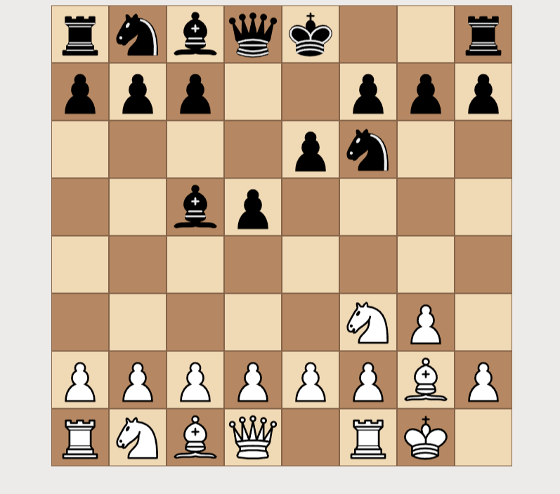
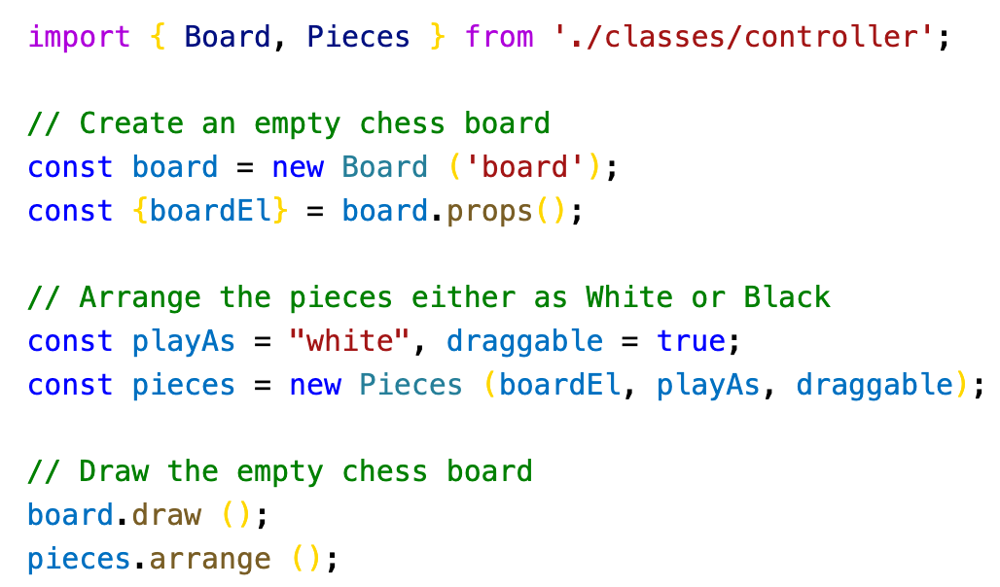
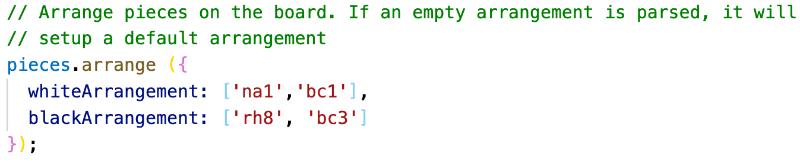

Use this code to create programmatic chess using Javascript and Node.js.

View a live version here: https://chess-trainer-be18a.firebaseapp.com/

You can drag-and-drop pieces or place them on the board using JavaScript and also detect which piece the player has clicked.

The board can be arranged from both perspectives: black or white.

You can also provide Chess notations to pre-set the piece arrangement.

This templated code basically provides all the functionality of a Chess board but leaves out "Legal Moves" and "AI". Those can be incorporated as desired using other third party modules.

Once the repository is cloned, simply run the following commands:

> npm install

This will install all the dependencies listed in the <strong>package.json</strong>, including the node modules. Once installed, run this command:

> npm run serve

The above command will execute the babel module and use webpack to bundle all the modules into a single javascript file.

Production files are created in the <strong>/dist</strong> folder whereas all developer files (i.e. javascript files) should be entered in the <strong>/src</strong> folder. The webpack module will automatically take any files with .js and .css extension in this folder for production. Run the following command once to create production assets:

> npm run build
